# PicShift
**_Transfer artistic styles between different images._**

The Neural Style algorithm synthesizes an imitation by separating and combining the content of one image with the style of another image using convolutional neural networks (CNN).

- An african lion synthesized with 6 different artistic styles :- 

<br>
<p align="center">

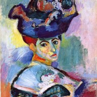
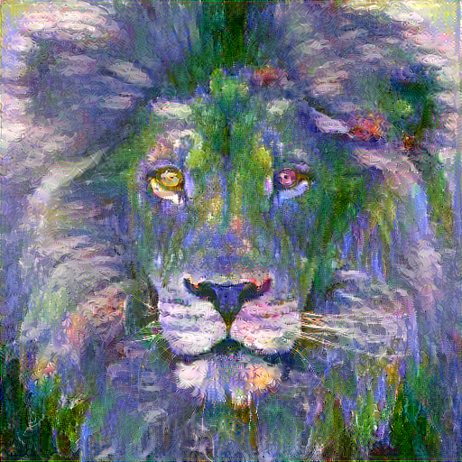


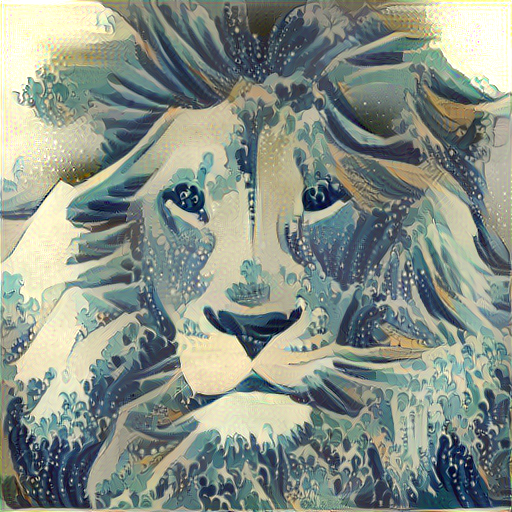


  

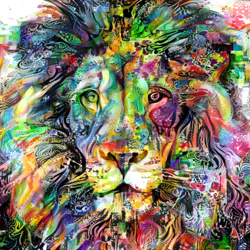


</p>
<br>

**(Left to right)** -
1. [Henry Matisse - Fauvism](https://en.wikipedia.org/wiki/Fauvism)
2. [Claude Monet - Water Lillies](https://en.wikipedia.org/wiki/Water_Lilies_(Monet_series))
3. [Hokusai - The Great Wave](https://en.wikipedia.org/wiki/The_Great_Wave_off_Kanagawa)
4. [Basquiat - Untitled(Skull)](https://en.wikipedia.org/wiki/Untitled_(Skull))
5. [Callie Fink - Enigma](https://fineartamerica.com/featured/enigma-callie-fink.html)
6. [Giger - BioMech](https://co.pinterest.com/pin/440719513535704730/)
<br>

- Neckarfront in Tübingen, Germany synthesized with 5 iconic painting styles :- (Left to Right)
<br>

<p align="center">


</p>
<br>

**(Left to right)** -
1. [Neckarfront - Tubingen (Original)](https://en.wikipedia.org/wiki/Neckarfront)
2. [Joseph Turner - The Shipwreck of the Minotaur](https://www.artble.com/artists/joseph_mallord_william_turner/paintings/the_shipwreck_of_the_minotaur)
3. [Vincent van Gogh - The Starry Night](https://www.wikiart.org/en/vincent-van-gogh/the-starry-night-1889)
4. [Kandinsky - Composition VII](https://www.wikiart.org/en/wassily-kandinsky/composition-vii-1913)
5. [Edvard Munch - The Scream](https://www.wikiart.org/en/edvard-munch/the-scream-1893)
6. [Pablo Picasso - Seated Nude](http://www.pablopicasso.org/seated-nude.jsp)
<br>

### Content / Style Tradeoff
The relative weight of the style and content can be controlled.

Here we render with an increasing style weight applied to [Red Canna](http://www.georgiaokeeffe.net/red-canna.jsp) :-

<br>
<p align="center">
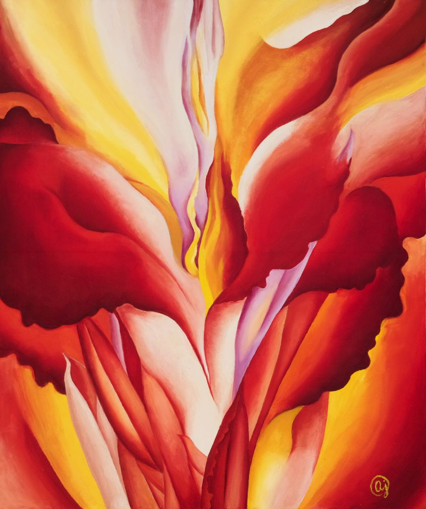


</p>
<br>

### Multiple Style Images
More than one style image can be used to blend multiple artistic styles.

Neckarfront with multiple styles :-

<br>
<p align="center">
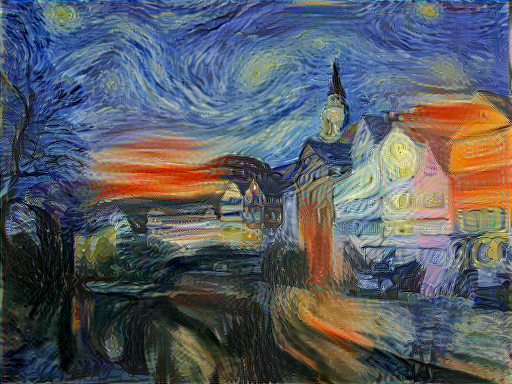

  

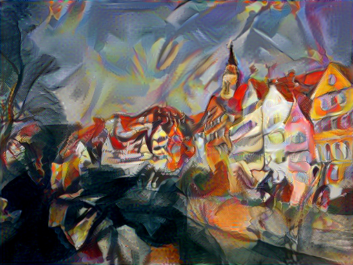


</p>
<br>

**(Left to right)** -
1. [The Starry Night](https://www.wikiart.org/en/vincent-van-gogh/the-starry-night-1889) + [The Scream](https://www.wikiart.org/en/edvard-munch/the-scream-1893)
2. [The Scream](https://www.wikiart.org/en/edvard-munch/the-scream-1893) + [Composition VII](https://www.wikiart.org/en/wassily-kandinsky/composition-vii-1913)
3. [Seated Nude](http://www.pablopicasso.org/seated-nude.jsp) + [Composition VII](https://www.wikiart.org/en/wassily-kandinsky/composition-vii-1913)  
4. [Seated Nude](http://www.pablopicasso.org/seated-nude.jsp) + [The Starry Night](https://www.wikiart.org/en/vincent-van-gogh/the-starry-night-1889)
5. [Oversoul](http://alexgrey.com/art/paintings/soul/oversoul/) + [Freshness of Cold](https://afremov.com/FRESHNESS-OF-COLD-PALETTE-KNIFE-Oil-Painting-On-Canvas-By-Leonid-Afremov-Size-30-x40.html)
6. [David Bowie](http://www.francoise-nielly.com/index.php/galerie/index/56) + [Skull](https://www.wikiart.org/en/jean-michel-basquiat/head) 
<br>

### Style Interpolation
When using multiple style images, the degree of blending between the images can be controlled.

Taj Mahal with style interpolation :- (weights of different art styles are mentioned in brackets)

<br>
<p align="center">
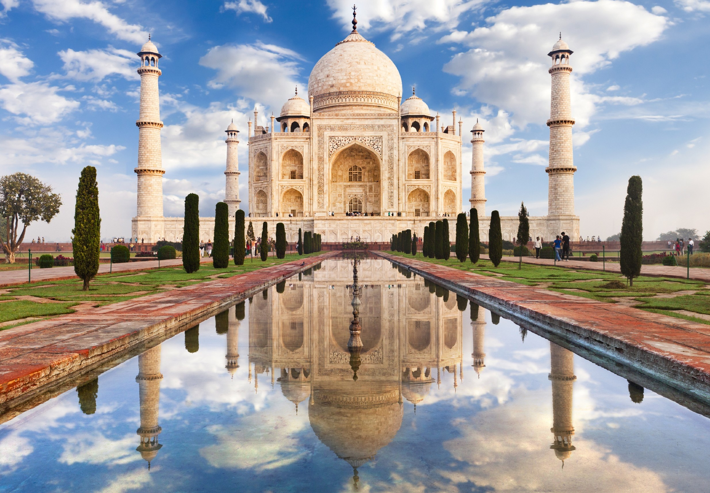
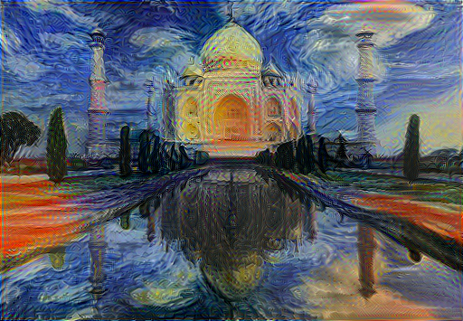
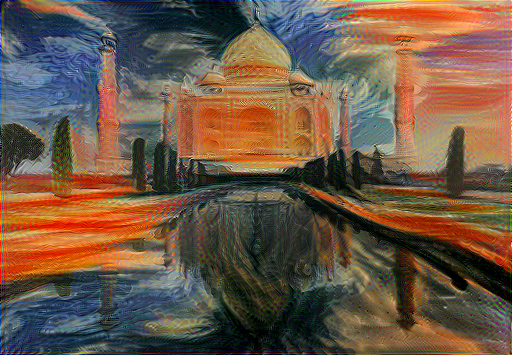


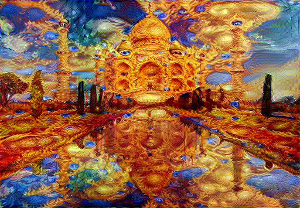
</p>
<br>

**(Left to right)** -
1. [Taj Mahal (Original)](https://en.wikipedia.org/wiki/Taj_Mahal)
2. (.2) [The Starry Night](https://www.wikiart.org/en/vincent-van-gogh/the-starry-night-1889) + (.8) [The Scream](https://www.wikiart.org/en/edvard-munch/the-scream-1893)
3. (.8) [The Starry Night](https://www.wikiart.org/en/vincent-van-gogh/the-starry-night-1889) + (.2) [The Scream](https://www.wikiart.org/en/edvard-munch/the-scream-1893)
4. (.2) [Oversoul](http://alexgrey.com/art/paintings/soul/oversoul/) + (.8) [Freshness of Cold](https://afremov.com/FRESHNESS-OF-COLD-PALETTE-KNIFE-Oil-Painting-On-Canvas-By-Leonid-Afremov-Size-30-x40.html)
5. (.5) [Oversoul](http://alexgrey.com/art/paintings/soul/oversoul/) + (.5) [Freshness of Cold](https://afremov.com/FRESHNESS-OF-COLD-PALETTE-KNIFE-Oil-Painting-On-Canvas-By-Leonid-Afremov-Size-30-x40.html)
6. (.8) [Oversoul](http://alexgrey.com/art/paintings/soul/oversoul/) + (.2) [Freshness of Cold](https://afremov.com/FRESHNESS-OF-COLD-PALETTE-KNIFE-Oil-Painting-On-Canvas-By-Leonid-Afremov-Size-30-x40.html) 
<br>

### Transfer style but not color
The color scheme of the original image can be preserved by including the flag `--original_colors`. 

Colors are transferred using either the [YUV](https://en.wikipedia.org/wiki/YUV), [YCrCb](https://en.wikipedia.org/wiki/YCbCr), [CIE L\*a\*b\*](https://en.wikipedia.org/wiki/Lab_color_space), or [CIE L\*u\*v\*](https://en.wikipedia.org/wiki/CIELUV) color spaces.

<br>
<p align="center">


</p>
<br>

_Left to right_: 
**_content image, stylized image, stylized image with the original colors of the content image_**

### Textures
The algorithm is not constrained to artistic painting styles.  

It can also be applied to photographic textures to create [pareidolic](https://en.wikipedia.org/wiki/Pareidolia) images :-
<br>
<p align="center">


</p>
<br>

## Setup
#### Dependencies :-
* [Tensorflow](https://github.com/tensorflow/tensorflow)
* [OpenCV](http://opencv.org/downloads.html)

#### Optional (but recommended) dependencies :-
* [CUDA](https://developer.nvidia.com/cuda-downloads)
* [cuDNN](https://developer.nvidia.com/cudnn)

#### After installing the dependencies: 
* Download the [VGG-19 model weights (imagenet-vgg-verydeep-19.mat)](https://www.vlfeat.org/matconvnet/models/imagenet-vgg-verydeep-19.mat)
* After downloading, copy the weights file `imagenet-vgg-verydeep-19.mat` to the project directory.

## How to Use

1. Copy content images to the default image content directory `./image_input`  
2. Copy 1 or more style images to the default style directory `./styles`  
3. Run the command with specific arguments:
```
python neural_style.py <arguments>
```
*Example (Single Image)*:
```
python neural_style.py --content_img golden_gate.jpg \
                       --style_imgs starry-night.jpg \
                       --max_size 1000 \
                       --max_iterations 100 \
                       --original_colors \
                       --device /cpu:0 \
                       --verbose;
```

To use multiple style images, pass a *space-separated* list of the image names and image weights like this:

`--style_imgs starry_night.jpg the_scream.jpg --style_imgs_weights 0.5 0.5`

#### Arguments
* `--content_img`: Filename of the content image. *Example*: `lion.jpg`
* `--content_img_dir`: Relative or absolute directory path to the content image. *Default*: `./image_input`
* `--style_imgs`: Filenames of the style images. To use multiple style images, pass a *space-separated* list.  *Example*: `--style_imgs starry-night.jpg`
* `--style_imgs_weights`: The blending weights for each style image.  *Default*: `1.0` (assumes only 1 style image)
* `--style_imgs_dir`: Relative or absolute directory path to the style images. *Default*: `./styles`
* `--init_img_type`: Image used to initialize the network. *Choices*: `content`, `random`, `style`. *Default*: `content`
* `--max_size`: Maximum width or height of the input images. *Default*: `512`
* `--content_weight`: Weight for the content loss function. *Default*: `5e0`
* `--style_weight`: Weight for the style loss function. *Default*: `1e4`
* `--tv_weight`: Weight for the total variational loss function. *Default*: `1e-3`
* `--temporal_weight`: Weight for the temporal loss function. *Default*: `2e2`
* `--content_layers`: *Space-separated* VGG-19 layer names used for the content image. *Default*: `conv4_2`
* `--style_layers`: *Space-separated* VGG-19 layer names used for the style image. *Default*: `relu1_1 relu2_1 relu3_1 relu4_1 relu5_1`
* `--content_layer_weights`: *Space-separated* weights of each content layer to the content loss. *Default*: `1.0`
* `--style_layer_weights`: *Space-separated* weights of each style layer to loss. *Default*: `0.2 0.2 0.2 0.2 0.2`
* `--original_colors`: Boolean flag indicating if the style is transferred but not the colors.
* `--color_convert_type`: Color spaces (YUV, YCrCb, CIE L\*u\*v\*, CIE L\*a\*b\*) for luminance-matching conversion to original colors. *Choices*: `yuv`, `ycrcb`, `luv`, `lab`. *Default*: `yuv`
* `--style_mask`: Boolean flag indicating if style is transferred to masked regions.
* `--style_mask_imgs`: Filenames of the style mask images (example: `face_mask.png`). To use multiple style mask images, pass a *space-separated* list.  *Example*: `--style_mask_imgs face_mask.png face_mask_inv.png`
* `--noise_ratio`: Interpolation value between the content image and noise image if network is initialized with `random`. *Default*: `1.0`
* `--seed`: Seed for the random number generator. *Default*: `0`
* `--model_weights`: Weights and biases of the VGG-19 network.  Download [here](http://www.vlfeat.org/matconvnet/pretrained/). *Default*:`imagenet-vgg-verydeep-19.mat`
* `--pooling_type`: Type of pooling in convolutional neural network. *Choices*: `avg`, `max`. *Default*: `avg`
* `--device`: GPU or CPU device.  GPU mode highly recommended but requires NVIDIA CUDA. *Choices*: `/gpu:0` `/cpu:0`. *Default*: `/gpu:0`
* `--img_output_dir`: Directory to write output to.  *Default*: `./image_output`
* `--img_name`: Filename of the output image. *Default*: `result`
* `--verbose`: Boolean flag indicating if statements should be printed to the console.

#### Optimization Arguments
* `--optimizer`: Loss minimization optimizer.  L-BFGS gives better results.  Adam uses less memory. *Choices*: `lbfgs`, `adam`. *Default*: `lbfgs`
* `--learning_rate`: Learning-rate parameter for the Adam optimizer. *Default*: `1e0`  
* `--max_iterations`: Max number of iterations for the Adam or L-BFGS optimizer. *Default*: `1000`
* `--print_iterations`: Number of iterations between optimizer print statements. *Default*: `50`
* `--content_loss_function`: Different constants K in the content loss function. *Choices*: `1`, `2`, `3`. *Default*: `1`
